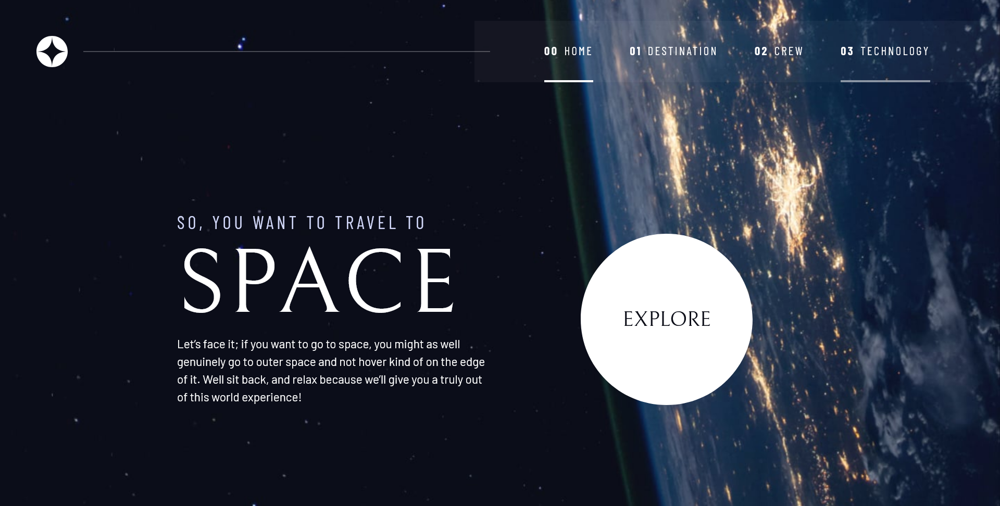
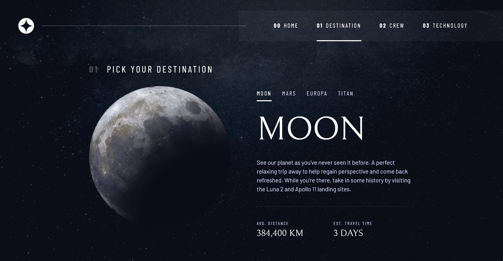
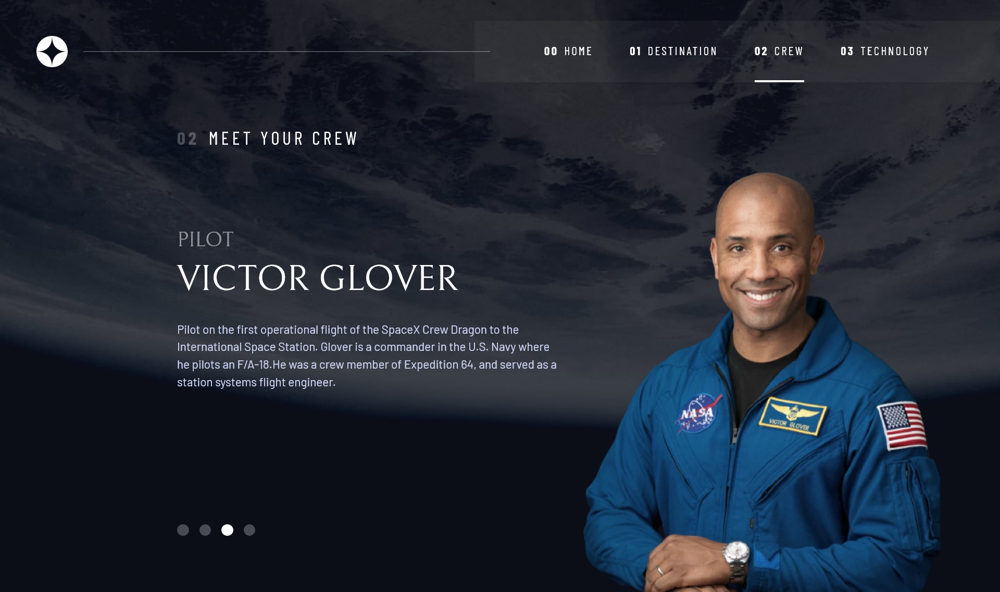
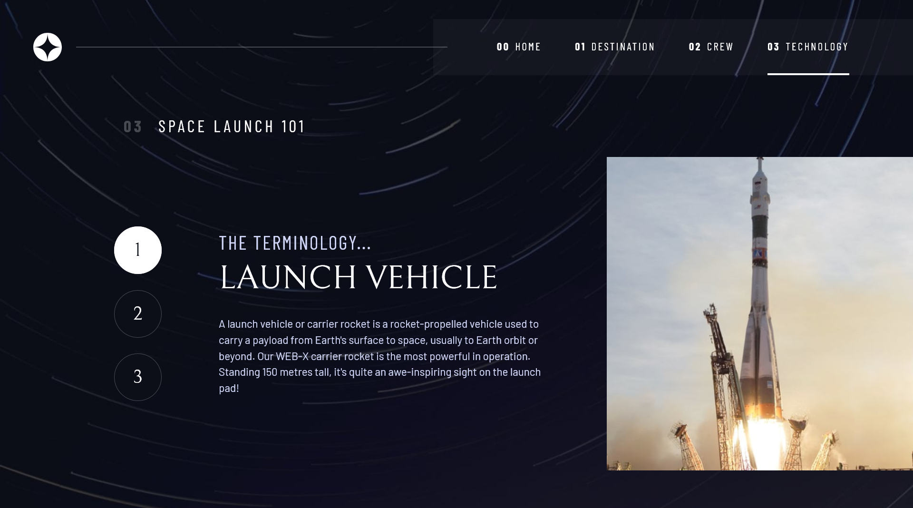

# Space tourism website
A website built with HTML, CSS and JavaScript for space exploration journeys.

## Table of contents
- [Overview](#overview)
  - [Description](#description)
  - [Screenshots](#screenshots)
  - [Links](#links)
- [Built with](#built-with)
- [Files and Directories](#files-and-directories)
- [Installation](#installation)
- [Author](#author)
- [Acknowledgment](#acknowledgment)

## Overview

### Description
This website is a project that provides information about space tourism destinations, the crew behind the project, and the technologies used for space travel. The website aims to be a comprehensive resource for customers interested in space travel, providing information on destinations, the team and the technologies used for space travel.

### Screenshots

### Links

- Solution URL: [Add solution URL here](https://github.com/fatima-xs/space-travel-website)
- Live Site URL: [Add live site URL here](https://your-live-site-url.com)

## Built with

- Semantic HTML5 markup
- CSS custom properties
- Flexbox
- CSS Grid
- Vanilla Javascript

## Files & directories
- index.html : the home page
- destination.html : the destinations page
- crew.html : the team page
- technology.html : the technologies page
- js : the directory containing the javascript files
- assets : the directory containing the images

## Installation
- Clone this repository to your desktop
- Navigate to the top level of the directory
- Open ./index.html in your browser

## Author
**Fatimata Ndiaye**
- [Profile](https://github.com/fatima-xs "Fatima Ndiaye") 
- [Email](mailto:rohitjain19060@gmail.com?subject=Hi "Hi!")

## Acknowledgment
Thank you Kevin Powell for his amazing guidance throughout this project!

